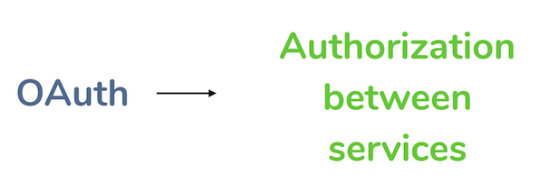
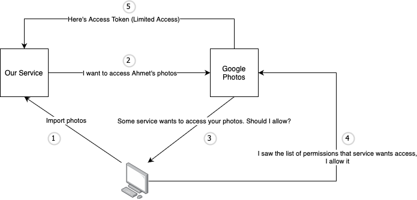

## **What is Authentication?**

The process or action of proving or showing something to ensure that the person accessing a system or application is who they claim to be. In computer science, this term is typically associated with proving a user’s identity.

## **What is Authorization?**

Authorization is the process of determining what actions a user is allowed to perform within a system or application.

## **What is the Difference between Authentication and Authorization?**
Authentication is the process of verifying the identity of the user and Authorization is the process of determining what a user is allowed to do within a system or application.

## **What is OAuth/2?**

OAuth stands for “Open Authorization”, and OAuth2 is its most common version. OAuth is a standard that is used for a service to authorize another service. It is not a standard for Authentication instead it is an Authorization standard by default.

**Example**

Imagine that we are developing a service that takes photos and applies some styling to them. Users need to upload their photos, but almost nobody stores their photos on their machines anymore. Most people use cloud platforms such as Google Photos to store their photos. Therefore, we need to find a way to import their photos from Google Photos to our service.

Our service could ask Google Photos to give us the user’s photos as follows:

Since Google does not know whether we have the user’s permission to access his/her photos or not, it would deny our request. In this case, our service could ask for users’ Google usernames and passwords to access their photos, but no one would give us their credentials due to trust issues. This is where OAuth comes in.

**OAuth Flow for the Given Example**

After getting the Access Token that has limited access to the other service, our service could send a request with Access Token to get the user’s photos.

OAuth standard allows services to give limited access to other services. Users are well aware of what our service wants to access first and give access then.

## **How can OAuth/2 Standard be used for Authentication?**
Some services provide Authentication mechanism to identify the users. Using OAuth standard we could easily integrate with the built-in Authentication services such as Google's Authentication service. Our service could ask Google to give us access to users' identical information such as e-mail address by using Access Token that we retrieved with OAuth communication. In permission list users would see what we are asking, and authorize us to access their identical information. As we get users' identical information, we could ensure that the person accessing a system or application is who they claim to be.
