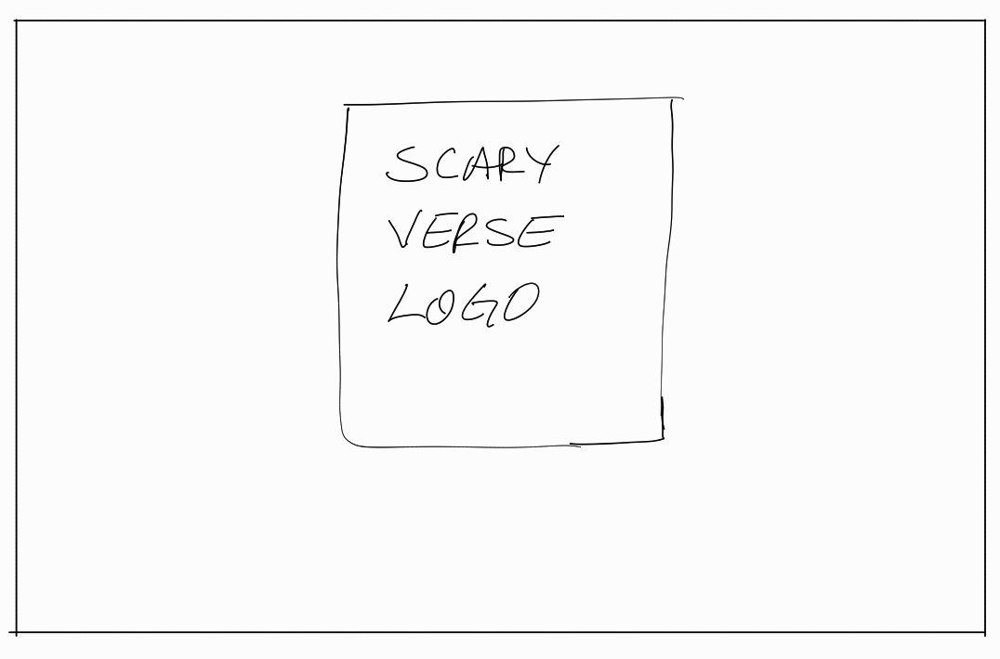

## **Intro Screen**
**Description:**
A simple introduction screen showing ScaryVerse logo similar to "EA Games" introduction screen

**Layout:**

## **Authentication Screens**
**Description:**
Multiple screens showing OTP-code, authentication URL, and the authentication status to the player

**Layout:**

Web:

VR:

## **Home Screen**
**Description:**
A screen showing a list of the player's previous teams and current invitations. Players can navigate to the "Team Detail" screen by clicking the arrows in the rows using the VR's controller. Also, invitations can be accepted or declined using the VR's controller.

**Layout:**

## **Team Detail Screen**
**Description:**
A screen showing details of the team including team name, players' information, and games played. Players can navigate to the "Game Detail" screen by clicking the arrows in the rows using the VR's controller.

Players can return to the "Home" screen using the back arrow button on the app bar.

**Layout:**

## **Game Detail Screen**
**Description:**
A screen showing details of the game including room name, complete time, total score earned by the player, and any achievements earned by the team.

Players can return to the "Team Detail" screen using the back arrow button on the app bar.

**Layout:**

## **Create New Game Screen**
**Description:**
A screen containing "Team Name" input, and current players' information about the team. Other players can be invited from this screen the right sidebar where all online players are listed. Players navigate to the "Room Selection" screen by clicking the "Next" button using the VR's controller.

Players can return to the "Home" screen using the back arrow button on the app bar.

**Layout:**

## **Room Selection Screen**
**Description:**
A screen showing the list of the rooms along with their descriptions, and poster image. Players can select a room to play by clicking the room card using the VR's controller. After clicking the "Start" button using the VR's controller, game will be started and the players would be navigated to the "Loading" screen.

**Layout:**

## **Loading Screen**
**Description:**
A screen showing a loading indicator after room selection for the game.

**Layout:**

## **Scoreboard Screen**
**Description:**
A screen that shows the ranking list of players along with their scores.

**Layout:**
